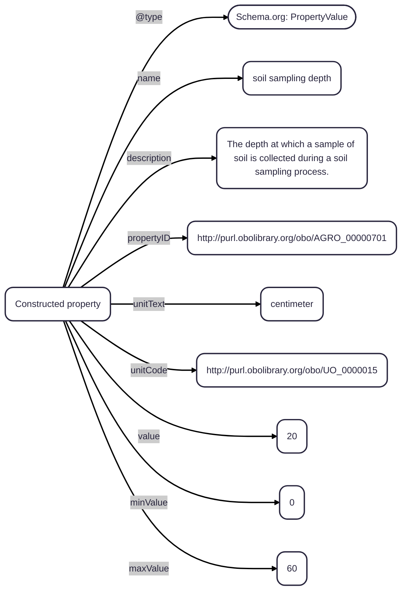

```mermaid
---
config:
  theme: redux
---
flowchart LR;
A("Constructed property")--"@type"-->B(["Schema.org: PropertyValue"])
A("Constructed property")--"name"-->C("soil sampling depth")
A("Constructed property")--"description"-->D("The depth at which a sample of soil is collected during a soil sampling process.")
A("Constructed property")--"propertyID"-->E("http://purl.obolibrary.org/obo/AGRO_00000701")
A("Constructed property")--"unitText"-->F("centimeter")
A("Constructed property")--"unitCode"-->G("http://purl.obolibrary.org/obo/UO_0000015")
A("Constructed property")--"value"-->H("20")
A("Constructed property")--"minValue"-->I("0")
A("Constructed property")--"maxValue"-->J("60")
```