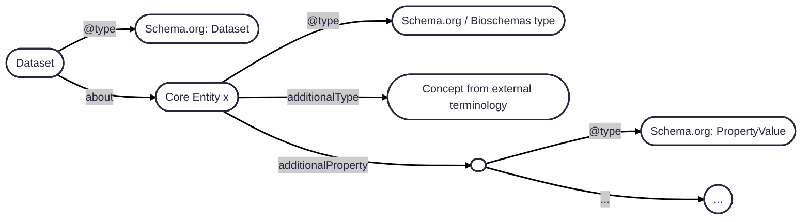

```mermaid
---
config:
  theme: redux
---
	flowchart LR;
	A(["Dataset"]) --"@type"-->B(["Schema.org: Dataset"])
	A(["Dataset"])--"about"-->C(["Core Entity"])
	C(["Core Entity x"]) --"@type"-->D(["Schema.org / Bioschemas type"])
	C(["Core Entity x"]) --"additionalType"-->E(["Concept from external terminology"])
	C(["Core Entity x"]) --"additionalProperty"-->G([" "])
	G([" "])--"@type"-->H(["Schema.org: PropertyValue"])
	G([" "])--... -->I(["..."])
```