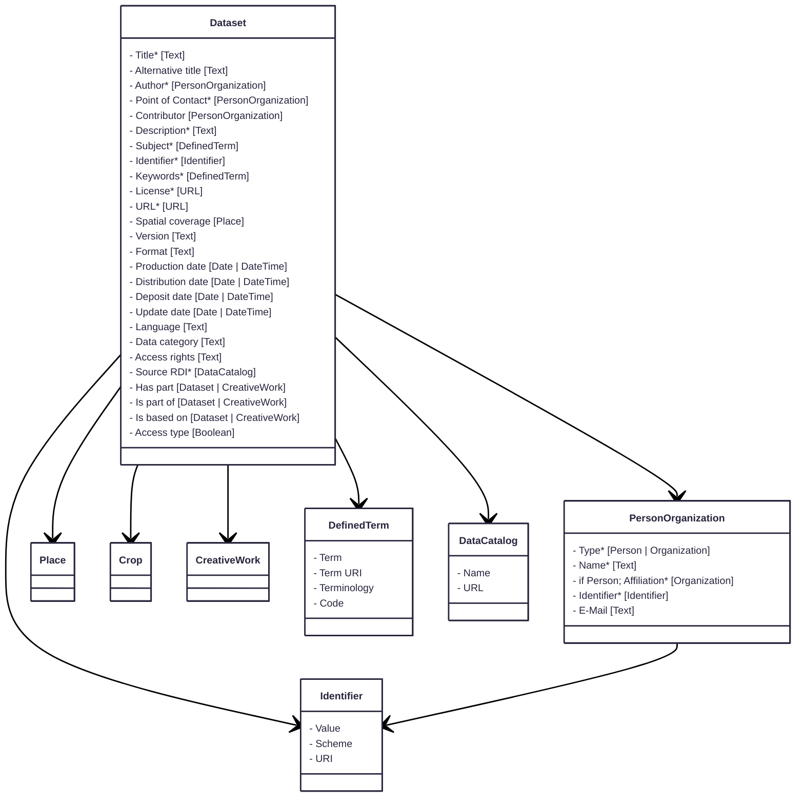

```mermaid
---
config:
  theme: redux
---
classDiagram
direction TB
    class PersonOrganization {
	    - Type* [Person | Organization]
	    - Name* [Text]
	    - if Person; Affiliation* [Organization]
	    - Identifier* [Identifier]
	    - E-Mail [Text]
    }

    class Place {
    }

    class Crop {
    }

    class CreativeWork {
    }

    class DefinedTerm {
	    - Term
	    - Term URI
	    - Terminology
	    - Code
    }

    class Identifier {
	    - Value
	    - Scheme
	    - URI
    }

    class DataCatalog {
	    - Name
	    - URL
    }

    class Dataset {
	    - Title* [Text]
	    - Alternative title [Text]
	    - Author* [PersonOrganization]
	    - Point of Contact* [PersonOrganization]
	    - Contributor [PersonOrganization]
	    - Description* [Text]
	    - Subject* [DefinedTerm]
	    - Identifier* [Identifier]
	    - Keywords* [DefinedTerm]
      - License* [URL]
      - URL* [URL]
	    - Spatial coverage [Place]
	    - Version [Text]
	    - Format [Text]
      - Production date [Date | DateTime]
      - Distribution date [Date | DateTime]
      - Deposit date [Date | DateTime]
      - Update date [Date | DateTime]
      - Language [Text]
      - Data category [Text]
      - Access rights [Text]
      - Source RDI* [DataCatalog]
      - Has part [Dataset | CreativeWork]
      - Is part of [Dataset | CreativeWork]
      - Is based on [Dataset | CreativeWork]
      - Access type [Boolean]
    }

    Dataset --> PersonOrganization
    Dataset --> DefinedTerm
    Dataset --> Identifier
    Dataset --> CreativeWork
    Dataset --> DataCatalog
    Dataset --> Place
    Dataset --> Crop
    PersonOrganization --> Identifier
```