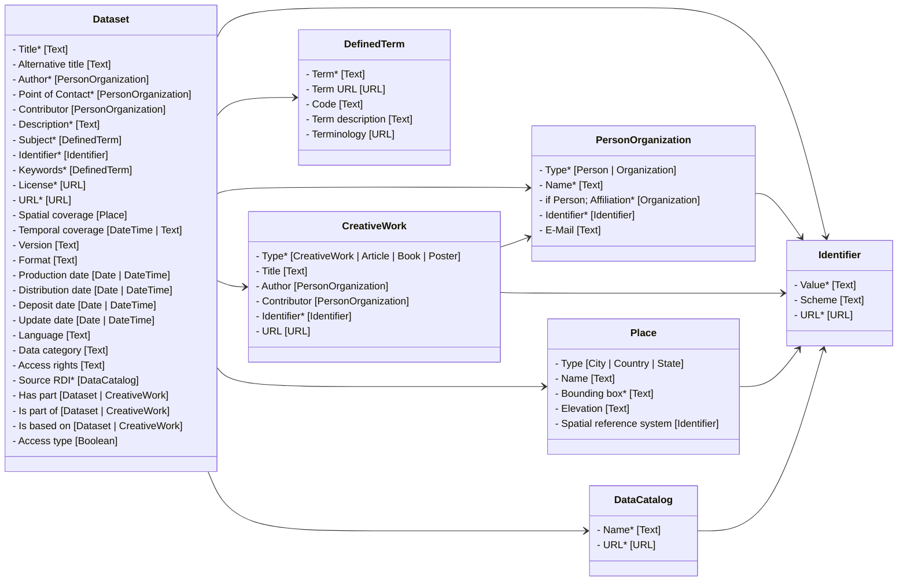

# FAIRagro Metadata Set for Publication Standards
Version 1
11.12.2025

## 1. Motivation

The FAIRagro Publication Metadata Set is a metadata schema for publishing research data sets in the agrosystem domain. It defines a core minimal metadata set to make required information available for FAIRagro services such as the FAIRagro Search Hub. It is harmonized with existing generic metadata standards as well as ongoing NFDI wide developments. In combination with Agrischemas, FAIRagros domain-specific metadata approach, it offers a solid foundation for FAIR datasets.

## 2. Metadata concepts


Cardinalities are defined in relation to their respective concepts. Example: A cardinality of “1” for a property does only apply, if an instance of its related concept exists. This doesn’t necessitate the existence of such an instance.

### 3.1 Dataset

**Definition:** A body of structured information describing some topic(s) of interest.

Schema.org representation:
```
{
	“@type”: “https://schema.org/Dataset”
}
```

#### 3.1.1 Title
**Definition:** “The main title of the Dataset” (taken from DataVerse)
**Cardinality:** 1
**Range:** Text
[Schema.org](http://schema.org) representation:
```
{
	“[https://schema.org/name](https://schema.org/name)”: “Example title”
}
```


