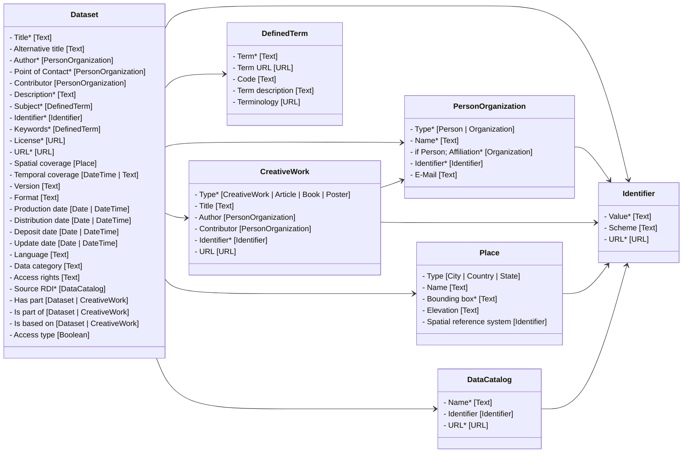

# FAIRagro Publication Metadata Set
Version 1
11.12.2025

##  1. Motivation


The FAIRagro Publication Metadata Set is a metadata schema for publishing research data sets in the agrosystem domain. It defines a core minimal metadata set to make required information available for FAIRagro services such as the FAIRagro Search Hub. It is harmonized with existing generic metadata standards as well as ongoing NFDI wide developments. In combination with Agrischemas, FAIRagros domain-specific metadata approach, it offers a solid foundation for FAIR datasets.

##  2. Metadata concepts


Cardinalities are defined in relation to their respective concepts. Example: A cardinality of "1" for a property does only apply, if an instance of its related concept exists. This doesn’t necessitate the existence of such an instance.

### 3.1 Dataset

**Definition:** "A body of structured information describing some topic(s) of interest."

Schema.org representation:
```
{
	"@type": "https://schema.org/Dataset"
}
```
"
#### 

 1. List item

#### 3.1.1 Title
**Definition:** "The main title of the Dataset." (taken from DataVerse)
**Cardinality:** 1
**Range:** Text

[Schema.org](http://schema.org) representation:
```
{
	"https://schema.org/name": "Example title"
}
```

#### 3.1.2 Alternative title
**Definition:** "Either 1) a title commonly used to refer to the Dataset or 2) an abbreviation of the main title.” (taken from DataVerse)." (taken from DataVerse)
**Cardinality:** 0-n
**Range:** Text

[Schema.org](http://schema.org) representation:
```
{
	"https://schema.org/alternativeHeadline": "An alternative title"
}
```
#### 3.1.3 Author
**Definition:** "The entity, e.g. a person or organization, that created the Dataset." (taken from DataVerse)
**Cardinality:** 1-n
**Range:** Person/Organization

[Schema.org](http://schema.org) representation:
```
{
  "https://schema.org/author": [
    {
      "@type": "https://schema.org/Person"
    }
  ]
}
```
/
```
{
  "https://schema.org/author": [
    {
      "@type": "https://schema.org/Organization"
    }
  ]
}
```

#### 3.1.4 Point of Contact
**Definition:** "The entity, e.g. a person or organization, that users of the Dataset can contact with questions." (taken from DataVerse)
**Cardinality:** 1-n
**Range:** Person/Organization
**Comment:**  [Schema.org](http://schema.org) doesn’t offer a fitting property or type to express this role. The [https://schema.org/ContactPoint](https://schema.org/ContactPoint) type and its related [https://schema.org/contactPoint](https://schema.org/contactPoint) are meant to express a contact point for a person/organization, not to express a person/organization as a contact point, as it is defined in Dataverse. To still model this information, at least one person/organization related to a Dataset as an author or contributor, needs to be additionally typed as a [https://w3id.org/evorao/ContactPoint](https://w3id.org/evorao/ContactPoint) by adding an [https://schema.org/additionalType](https://schema.org/additionalType) property to the person/organization metadata object.

[Schema.org](http://schema.org) representation:
```
{
	"@type":"https://schema.org/Person",
	"https://schema.org/additionalType": "https://w3id.org/evorao/ContactPoint"
}
```
/
```
{
  "@type": "https://schema.org/Organization",
  "https://schema.org/additionalType": "https://w3id.org/evorao/ContactPoint"
}
```

#### 3.1.5 Contributor
**Definition:** "The entity, such as a person or organization, responsible for collecting, managing, or otherwise contributing to the development of the Dataset." (taken from DataVerse)
**Cardinality:** 0-n
**Range:** Person/Organization

[Schema.org](http://schema.org) representation:
```
{
  "https://schema.org/contributor": {
    "@type": "https://schema.org/Person"
  }
}
```
/
```
{
  "https://schema.org/contributor": {
    "@type": "https://schema.org/Organization"
  }
}
```

#### 3.1.6 Contributor
**Definition:** "A summary describing the purpose, nature, and scope of the Dataset." (taken from DataVerse)
**Cardinality:** 1-n
**Range:** Text

[Schema.org](http://schema.org) representation:
```
{
  "https://schema.org/description": "An example description"
}
```
#### 3.1.7 Subject
**Definition:** "The area of study relevant to the Dataset." (taken from DataVerse)
**Cardinality:** 1-n
**Range:** DefinedTerm
**Comment:** DataVerse has a fixed list of subjects it accepts. For our domain, everything would fall under "Agricultural Sciences". We could model this via [https://schema.org/about](https://schema.org/about), link it to a [https://schema.org/DefinedTerm](https://schema.org/DefinedTerm) and use AGROVOCs "agricultural sciences" concept ([http://aims.fao.org/aos/agrovoc/c_49876](http://aims.fao.org/aos/agrovoc/c_49876)) for semantic enrichment.

[Schema.org](http://schema.org) representation:
```
{
  "https://schema.org/about": {
    "@type": "https://schema.org/DefinedTerm"
  }
}
```

#### 3.1.8 Identifier
**Definition:** "A unique identifier for the Dataset (e.g. producer's or repository's identifier)." (changed from DataVerse "otherId" definition)
**Cardinality:** 1-n
**Range:** Identifier
**Comment:** This property is used to store the identifiers from original data sources such as Research Data Infrastructures. Compared to DataVerses "otherId", it is mandatory for the FAIRagro Publication Metadata Set.

[Schema.org](http://schema.org) representation:
```
{
  "https://schema.org/identifier": {
    "@type": "https://schema.org/PropertyValue"
  }
}
```
#### 3.1.9 Keyword(s)
**Definition:** "A key term that describes an important aspect of the Dataset and information about any controlled vocabulary used." (taken from DataVerse)
**Cardinality:** 1-n
**Range:** DefinedTerm

[Schema.org](http://schema.org) representation:
```
{
  "https://schema.org/keywords": {
    "@type": "https://schema.org/DefinedTerm"
  }
}
```

#### 3.1.10 License
**Definition:** "License defining the rights to (re-)use the dataset." (taken from DataVerse)
**Cardinality:** 1
**Range:** URL
**Comment:** If possible, the "License" property should link to a record from the SPDX license list ([https://spdx.org/licenses/](https://spdx.org/licenses/)), a record from the Creative Commons license list ([https://creativecommons.org/share-your-work/cclicenses/](https://creativecommons.org/share-your-work/cclicenses/)) or to a separate ODRL compliant file.

[Schema.org](http://schema.org) representation:
```
{
  "https://schema.org/license": "https://spdx.org/licenses/CC-BY-4.0.html"
}
```

#### 3.1.11 URL
**Definition:** "An URL where one can view or access the data in the Dataset, e.g. the webpage of a Research Data Infrastructure." (changed from DataVerse "alternativeURL")
**Cardinality:** 1
**Range:** URL

[Schema.org](http://schema.org) representation:
```
{
  "https://schema.org/spatialCoverage": {
    "@type": "https://schema.org/Place"
  }
}
```

#### 3.1.12 Spatial coverage
**Definition:** "The spatialCoverage of a Dataset indicates the place(s) which are the focus of the content." (changed from Schema.org "[https://schema.org/spatialCoverage](https://schema.org/spatialCoverage)")
**Cardinality:** 0-n
**Range:** Place

[Schema.org](http://schema.org) representation:
```
{
  "https://schema.org/spatialCoverage": {
    "@type": "https://schema.org/Place"
  }
}
```

#### 3.1.13 Temporal coverage
**Definition:** "The temporalCoverage of a Dataset indicates the period that the content applies to, i.e. that it describes, either as a DateTime or as a textual string indicating a time period in [ISO 8601 time interval format](https://en.wikipedia.org/wiki/ISO_8601#Time_intervals). Open-ended date ranges can be written with ".." in place of the end date. For example, "2015-11/.." indicates a range beginning in November 2015 and with no specified final date." (changed from [https://schema.org/temporalCoverage](https://schema.org/temporalCoverage))
**Cardinality:** 0-1
**Range:** Text / DateTime

[Schema.org](http://schema.org) representation:
```
{
  "https://schema.org/temporalCoverage": "2022 - 2023"
}
```
#### 3.1.14 Version
**Definition:** "The version number of the dataset."
**Cardinality:** 0-1
**Range:** Text

[Schema.org](http://schema.org) representation:
```
{
  "https://schema.org/version": "v1.0"
}
```

#### 3.1.15 Format
**Definition:** "The file format(s) of the dataset."
**Cardinality:** 0-n
**Range:** Text

[Schema.org](http://schema.org) representation:
```
{
  "https://schema.org/encodingFormat": "application/zip"
}
```

#### 3.1.16 Production date
**Definition:** "The date when the data were produced (not distributed, published, or archived)." (taken from DataVerse)
**Cardinality:** 0-1
**Range:** Date or DateTime (ISO 8601)

[Schema.org](http://schema.org) representation:
```
{
  "https://schema.org/dateCreated": "2024-11-19"
}
```

#### 3.1.17 Distribution date
**Definition:** "The date when the Dataset was made available for distribution/presentation." (taken from DataVerse)
**Cardinality:** 0-1
**Range:** Date or DateTime (ISO 8601)

[Schema.org](http://schema.org) representation:
```
{
  "https://schema.org/datePublished": "2025-11-19"
}
```

#### 3.1.18 Deposit date
**Definition:** "The date when the Dataset was deposited into the repository." (taken from DataVerse)
**Cardinality:** 0-1
**Range:** Date or DateTime (ISO 8601)

[Schema.org](http://schema.org) representation:
```
***WIP***
```

#### 3.1.19 Update date
**Definition:** "The date on which the Dataset was most recently modified or when the item's entry was modified " (changed from [https://schema.org/dateModified](https://schema.org/dateModified))
**Cardinality:** 0-1
**Range:** Date or DateTime (ISO 8601)

[Schema.org](http://schema.org) representation:
```
{
  "https://schema.org/dateModified": "2025-11-19"
}
```

#### 3.1.20 Language
**Definition:** "A language that the Dataset's files is written in." (taken from DataVerse)
**Cardinality:** 0-n
**Range:** Text
**Comment:** Use language codes from [https://www.rfc-editor.org/info/bcp47](https://www.rfc-editor.org/info/bcp47).

[Schema.org](http://schema.org) representation:
```
{
  "https://schema.org/inLanguage": "de-DE"
}
```

#### 3.1.21 Data category
**Definition:** "A category the dataset belongs to."
**Cardinality:** 0-n
**Range:** Text
**Comment:** The categorization influences the available metadata modules for a dataset. If no category is available, only the core metadata module is used. For expressing the information in [Schema.org](http://schema.org), we could use [https://schema.org/additionalType](https://schema.org/additionalType).

[Schema.org](http://schema.org) representation:
```
***WIP***
```

#### 3.1.22 Access rights
**Definition:** "Information about who accesses the resource or an indication of its security status." (taken from [http://purl.org/dc/terms/accessRights](http://purl.org/dc/terms/accessRights))
**Cardinality:** 0-n
**Range:** Text

[Schema.org](http://schema.org) representation:
```
***WIP***
```

#### 3.1.23 Source RDI
**Definition:** "The original Research Data Infrastructure that the dataset was published by."
**Cardinality:** 1
**Range:** DataCatalog

[Schema.org](http://schema.org) representation:
```
{
  "https://schema.org/includedInDataCatalog": {
    "@type": "https://schema.org/DataCatalog"
  }
}
```

#### 3.1.24 Has part
**Definition:** "Indicates a Dataset or CreativeWork that is part of this item." (changed from [https://schema.org/hasPart](https://schema.org/hasPart))
**Cardinality:** 0-n
**Range:** Dataset/CreativeWork

[Schema.org](http://schema.org) representation:
```
{
  "https://schema.org/hasPart": {
    "@type": "https://schema.org/Dataset"
  }
}
```
/
```
{
  "https://schema.org/hasPart": {
    "@type": "https://schema.org/CreativeWork"
  }
}
```
#### 3.1.25 Is part of
**Definition:** "Indicates a Dataset or CreativeWork that this item." (changed from [https://schema.org/isPartOf](https://schema.org/isPartOf))
**Cardinality:** 0-n
**Range:** Dataset/CreativeWork

[Schema.org](http://schema.org) representation:
```
{
  "https://schema.org/isPartOf": {
    "@type": "https://schema.org/Dataset"
  }
}
```
/
```
{
  "https://schema.org/isPartOf": {
    "@type": "https://schema.org/CreativeWork"
  }
}
```

#### 3.1.26 Is based on
**Definition:** "A resource from which this Dataset is derived or from which it is a modification or adaptation. " (changed from [https://schema.org/isBasedOn](https://schema.org/isBasedOn))
**Cardinality:** 0-n
**Range:** Dataset/CreativeWork

[Schema.org](http://schema.org) representation:
```
{
  "https://schema.org/isBasedOn": {
    "@type": "https://schema.org/Dataset"
  }
}
```
/
```
{
  "https://schema.org/isBasedOn": {
    "@type": "https://schema.org/CreativeWork"
  }
}
```

#### 3.1.27 Access type
**Definition:** "A flag to signal that the item, event, or place is accessible for free." (taken from [https://schema.org/isAccessibleForFree](https://schema.org/isAccessibleForFree))
**Cardinality:** 0-1
**Range:** Boolean

[Schema.org](http://schema.org) representation:
```
{
  "https://schema.org/isAccessibleForFree": "True"
}
```
/
```
{
  "https://schema.org/isAccessibleForFree": "False"
}
```
#### 3.1.28 Spatial resolution
**Definition:** "The distance between independent geo measurements."
**Cardinality:** 0-1
**Range:** Text

[Schema.org](http://schema.org) representation:
```
***WIP***
```

### 3.2 Person/Organization
**Person definition:** A person (alive, dead, undead, or fictional). (taken from [https://schema.org/Person](https://schema.org/Person))

**Organization definition:** An organization such as a school, NGO, corporation, club, etc. (taken from [https://schema.org/Organization](https://schema.org/Organization))

#### 3.2.1 Type
**Definition:** "The distance between independent geo measurements."
**Cardinality:** 1
**Range:** [https://schema.org/Person](https://schema.org/Person) / [https://schema.org/Organization](https://schema.org/Organization)

[Schema.org](http://schema.org) representation:
```
{
  "@type": "https://schema.org/Person"
}
```
/
```
{
  "@type": "https://schema.org/Organization"
}
```

#### 3.2.2 Name
**Definition:** "The name of the person or the organization." (changed from DataVerse)
**Cardinality:** 1
**Range:** Text

[Schema.org](http://schema.org) representation:
```
{
  "https://schema.org/name": "Example name"
}
```
#### 3.2.3 Affiliation (Person)
**Definition:** "The name of the person or the organization." (changed from DataVerse)
**Cardinality:** 1
**Range:** Text

[Schema.org](http://schema.org) representation:
```
{
  "https://schema.org/affiliation": {
    "@type": "https://schema.org/Organization"
  }
}
```

#### 3.2.4 Identifier
**Definition:** "Uniquely identifies a person/organization when paired with an identifier type." (changed from DataVerse)
**Cardinality:** 1
**Range:** Identifier

[Schema.org](http://schema.org) representation:
```
{
  "https://schema.org/identifier": {
    "@type": "https://schema.org/PropertyValue"
  }
}
```

#### 3.2.4 E-Mail
**Definition:** "A person/organization contact email address." (changed from DataVerse)
**Cardinality:** 0-1
**Range:** Text

[Schema.org](http://schema.org) representation:
```
{
  "https://schema.org/email": "email@example.org"
}
```

### 3.3 Identifier
**Definition:** A unique identifier of the an entity (e.g. a Dataset, a Person, an Organization) (changed from [https://www.w3.org/TR/vocab-dcat-3/#Property:resource_identifier](https://www.w3.org/TR/vocab-dcat-3/#Property:resource_identifier))

[Schema.org](http://schema.org) representation:
```
{
  "@type": "https://schema.org/PropertyValue"
}
```
#### 3.3.1 Value
**Definition:** "The value of an identifier."
**Cardinality:** 1
**Range:** Text

[Schema.org](http://schema.org) representation:
```
{
  "https://schema.org/value": "10.1000/182"
}
```

#### 3.3.2 Scheme
**Definition:** "The type of identifier (e.g. DOI, ORCID)." (changed from Dataverse)
**Cardinality:** 0-1
**Range:** Text / URL
**Comment:** Use [https://schema.org/propertyID](https://schema.org/propertyID) to preferably point to a record in an identifier registry (e.g. [https://registry.identifiers.org/registry/orcid](https://registry.identifiers.org/registry/orcid)), the official namespace of an identifier (e.g. [https://orcid.org/](https://orcid.org/)) or provide a string value (e.g. "orcid").

[Schema.org](http://schema.org) representation:
```
{
  "https://schema.org/propertyID": "https://registry.identifiers.org/registry/orcid"
}
```

#### 3.3.3 URL
**Definition:** "Resolvable URL of an identifier."
**Cardinality:** 0-1
**Range:** URL

[Schema.org](http://schema.org) representation:
```
{
  "https://schema.org/url": "https://doi.org/example123/"
}
```

### 3.4 DefinedTerm
Definition: "A word, name, acronym, phrase, etc. with a formal definition. Often used in the context of category or subject classification, glossaries or dictionaries, product or creative work types, etc." (taken from [https://schema.org/DefinedTerm](https://schema.org/DefinedTerm))

[Schema.org](http://schema.org) representation:
```
{
"@type": "https://schema.org/DefinedTerm"
}
```


#### 3.4.1 Term
**Definition:** "A key term that describes important aspects of the Dataset." (taken from Dataverse)
**Cardinality:** 1
**Range:** Text

[Schema.org](http://schema.org) representation:
```
{
  "https://schema.org/name": "An example defined term"
}
```
#### 3.4.2 Term description
**Definition:** "A description/definition of the DefinedTerm. " (changed from [https://schema.org/description](https://schema.org/description))
**Cardinality:** 0-1
**Range:** Text

[Schema.org](http://schema.org) representation:
```
{
  "https://schema.org/description": "Agriculture or farming is the cultivation and breeding of animals, plants and fungi for food, fiber, biofuel, medicinal plants and other products used to sustain and enhance human life."
}
```

#### 3.4.3 Term URL
**Definition:** "A URL that points to the web presence of the Defined Term" (changed from Dataverse)
**Cardinality:** 0-1
**Range:** Text

[Schema.org](http://schema.org) representation:
```
{
  "https://schema.org/url": "http://aims.fao.org/aos/agrovoc/c_203"
}
```

#### 3.4.4 Code
**Definition:** ""A code that identifies a term within a terminology." (changed [https://schema.org/termCode](https://schema.org/termCode))"
**Cardinality:** 0-1
**Range:** Text

[Schema.org](http://schema.org) representation:
```
{
  "https://schema.org/termCode": "c_203"
}
```

#### 3.4.5 Terminology
**Definition:** "The controlled vocabulary used for the keyword term (e.g. AGROVOC, GEMET)." (changed from Dataverse)
**Cardinality:** 0-1
**Range:** URL

[Schema.org](http://schema.org) representation:
```
{
  "https://schema.org/inDefinedTermSet": "http://aims.fao.org/aos/agrovoc"
}
```
### 3.5 DataCatalog
**Definition:** "A collection of datasets, e.g. a Research Data Infrastructure." (changed from [https://schema.org/DataCatalog](https://schema.org/DataCatalog))

[Schema.org](http://schema.org) representation:
```
{
  "@type": "https://schema.org/DataCatalog"
}
```

#### 3.5.1 Name
**Definition:** "The name of a Research Data Infrastructure/DataCatalog."
**Cardinality:** 1
**Range:** Text

[Schema.org](http://schema.org) representation:
```
{
  "https://schema.org/name": "OpenAgrar"
}
```

#### 3.5.2 Identifier
**Definition:** "The Identifier of a Research Data Infrastructure/DataCatalog"
**Cardinality:** 0-1
**Range:** Identifier

[Schema.org](http://schema.org) representation:
```
{
  "https://schema.org/identifier": {
    "@type": "https://schema.org/PropertyValue"
  }
}
```
#### 3.5.3 URL
**Definition:** "The URL of a Research Data Infrastructure/DataCatalog."
**Cardinality:** 1
**Range:** URL

[Schema.org](http://schema.org) representation:
```
{
  "https://schema.org/url": "https://www.openagrar.de/"
}
```

### 3.6 CreativeWork
**Definition:** "The most generic kind of creative work, including books, movies, photographs, software programs, etc." (taken [https://schema.org/CreativeWork](https://schema.org/CreativeWork) )

#### 3.6.1 Type
**Definition:** "The specific type of a creative work (e.g. an article, book)."
**Cardinality:** 1
**Range:** [https://schema.org/CreativeWork](https://schema.org/CreativeWork); [https://schema.org/Article](https://schema.org/Article); [https://schema.org/Book](https://schema.org/Book); [https://schema.org/Poster](https://schema.org/Poster)

**Comment:** Dataverse does not allow for the typisation of a related publication via a property, but [Schema.org](http://schema.org) does. [Schema.org](http://schema.org) offers different subtypes of [https://schema.org/CreativeWork](https://schema.org/CreativeWork). To guarantee consistent mapping to the correct fields in Dataverse this modeling via choosing a fitting type for the CreativeWork object in [Schema.org](http://schema.org) is necessary.

[Schema.org](http://schema.org) representation:
```
{
  "@type": "https://schema.org/CreativeWork"
}
```
/
```
{
  "@type": "https://schema.org/Article"
}
```
/
```
{
  "@type": "https://schema.org/Book"
}
```
/
```
{
  "@type": "https://schema.org/Poster"
}
```

#### 3.6.2 Author
**Definition:** "The entity, e.g. a person or organization, that created the CreativeWork" (changed from DataVerse)
**Cardinality:** 0-n
**Range:** Person/Organization

[Schema.org](http://schema.org) representation:
```
{
  "https://schema.org/author": {
    "@type": "https://schema.org/Person"
  }
}
```
/
```
{
  "https://schema.org/author": {
    "@type": "https://schema.org/Organization"
  }
}
```

#### 3.6.3 Contributor
**Definition:** "The entity, such as a person or organization, responsible for collecting, managing, or otherwise contributing to the development of the CreativeWork" (changed from DataVerse)
**Cardinality:** 0-n
**Range:** Person/Organization

[Schema.org](http://schema.org) representation:
```
{
  "https://schema.org/author": {
    "@type": "https://schema.org/Person"
  }
}
```
/
```
{
  "https://schema.org/author": {
    "@type": "https://schema.org/Organization"
  }
}
```

#### 3.6.4 Title
**Definition:** "The main title of a creative work."
**Cardinality:** 0-1
**Range:** Text

[Schema.org](http://schema.org) representation:
```
{
  "https://schema.org/name": "Example title"
}
```
#### 3.6.5 Identifier
**Definition:** "An identifier of a creative work."
**Cardinality:** 1
**Range:** Text

[Schema.org](http://schema.org) representation:
```
{
  "https://schema.org/identifier": {
    "@type": "https://schema.org/PropertyValue"
  }
}
```
#### 3.6.6 URL
**Definition:** "An identifier of a creative work."
**Cardinality:** 0-1
**Range:** Text

[Schema.org](http://schema.org) representation:
```
{
  "https://schema.org/url": "https://zenodo.org/records/7528172"
}
```

### 3.7 Place
**Definition:** "Entities that have a somewhat fixed, physical extension." (taken from [https://schema.org/Place](https://schema.org/Place))

#### 3.7.1 Type
**Definition:** "The specific type of a place (e.g. a city, country, state)."
**Cardinality:** 0-1
**Range:** [https://schema.org/City](https://schema.org/City); [https://schema.org/Country](https://schema.org/Country); [https://schema.org/State](https://schema.org/State)
**Comment:** Dataverse doesn’t allow a typisation of different places, but [Schema.org](http://schema.org) does.  To guarantee consistent mapping to the correct fields in Dataverse (City, Country, State) this modeling via choosing a fitting type for the Place object in [Schema.org](http://schema.org) is necessary.

[Schema.org](http://schema.org) representation:
```
{
  "@type": "https://schema.org/City"
}
```
/
```
{

"@type": "[https://schema.org/Country](https://schema.org/Country)"

}
```
/
```
{
  "@type": "https://schema.org/State"
}
```

#### 3.7.2 Name
**Definition:** "The name of a place."
**Cardinality:** 0-1
**Range:** Text

[Schema.org](http://schema.org) representation:
```
{
  "https://schema.org/name": "Germany"
}
```

#### 3.7.3 Bounding box
**Definition:** "A box is the area enclosed by the rectangle formed by two points. The first point is the lower corner, the second point is the upper corner. A box is expressed as two points separated by a space character." (taken from [https://schema.org/box](https://schema.org/box))
**Cardinality:** 1
**Range:** Text
**Comments:** [Schema.org](http://schema.org) uses the [https://schema.org/GeoShape](https://schema.org/GeoShape) type to attach geospatial information to a Place object, via the [https://schema.org/geo](https://schema.org/geo) property. A bounding box can then be attached to this object.

[Schema.org](http://schema.org) representation:
```
{
  "https://schema.org/geo": {
    "@type": "https://schema.org/GeoShape",
    "https://schema.org/box": "38.920952 -94.645443 38.951797 -94.680439"
  }
}
```
#### 3.7.4 Elevation
**Definition:** "Altitude, like elevation, is the distance above sea level."
**Cardinality:** 0-1
**Range:** Text

[Schema.org](http://schema.org) representation:
```
{
  "https://schema.org/additionalProperty": {
    "@type": "https://schema.org/PropertyValue",
    "https://schema.org/name": "elevation",
    "https://schema.org/propertyID": "http://aims.fao.org/aos/agrovoc/c_316",
    "https://schema.org/unitText": "meter",
    "https://schema.org/unitCode": "http://purl.obolibrary.org/obo/UO_0000008",
    "https://schema.org/value": "65"
  }
}
```
#### 3.7.5 Spatial reference system
**Definition:** "The spatial reference system used for the measured geocoordinates."
**Cardinality:** 0-1
**Range:** Identifier
**Comment:** For the value of a spatial reference system please use EPSG codes where possible.
[Schema.org](http://schema.org) representation:
```
{
  "https://schema.org/additionalProperty": {
    "@type": "https://schema.org/PropertyValue",
    "https://schema.org/name": "spatial reference system",
    "https://schema.org/propertyID": "https://www.commoncoreontologies.org/ont00000275",
    "https://schema.org/value": "EPSG:4326"
  }
}
```

